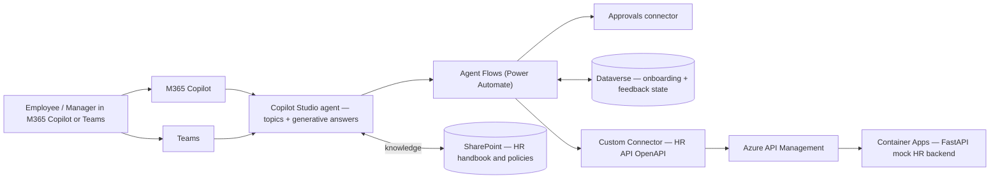

# Architecture — Solution B: Microsoft Copilot Studio

Mermaid source

## Key choices

- **Copilot Studio** owns the conversational surface; one topic per UC.
- **Generative answers + SharePoint knowledge** for UC1 (no custom RAG needed).
- **Agent Flows** (Power Automate) for everything stateful or multi-step (UC2, UC3, UC5).
- **Approvals connector** for UC2 manager approval — no custom card code.
- **Dataverse** for onboarding plan rows (UC3) and feedback responses (UC5).
- **Custom Connector** generated from the FastAPI backend's OpenAPI spec, fronted by **APIM** for OAuth.
- **Built-in human handoff** to Teams for UC6 escalations.
