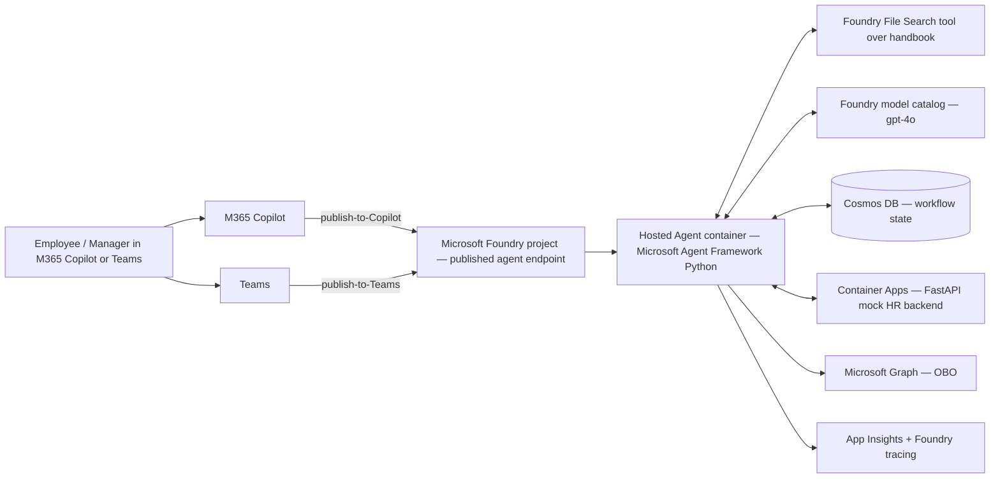

# Architecture — Solution C: Microsoft Foundry hosted agent

Mermaid source

## Key choices

- **Foundry project** is mandatory per the brief. All Azure resources sit under one project.
- **Hosted agent** (preview) — code-first using **Microsoft Agent Framework (Python)**, deployed to Foundry as a container.
- **Foundry File Search** built-in tool for UC1 (handbook uploaded to the project) — no separate Azure AI Search.
- **Cosmos DB** for long-running workflow state (UC3, UC5).
- **Foundry → M365 Copilot publish** is the surfacing path. No M365 Agents SDK shell, no Copilot Studio in front.
- **Agent identity** (Entra) used for Microsoft Graph calls in UC2 (manager DM) and UC6 (handoff chat) via OBO.
- **Foundry agent tracing + App Insights** for observability.
