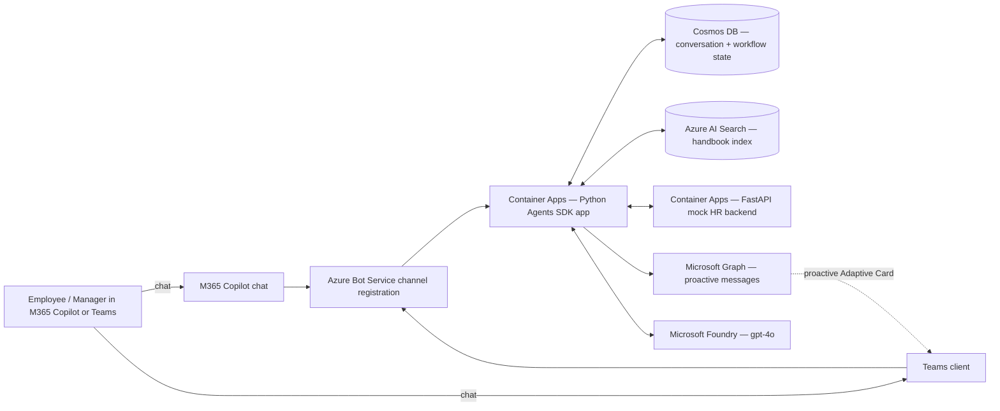

# Architecture — Solution A: Microsoft 365 Agents SDK

Mermaid source

## Key choices

- **Azure Bot Service** registration; one channel for M365 Copilot, one for Teams.
- **Container Apps** for the agent runtime (not Functions: long-lived turn handlers + WebSocket-friendly).
- **Cosmos DB** for conversation references (needed for proactive messages in UC2/UC3) and workflow checkpoints.
- **Azure AI Search** for UC1 RAG over `shared-fixtures/policies/`.
- **Microsoft Graph** with the bot's managed identity for proactive Teams messages and creating handoff chats (UC6).
- **Microsoft 365 Agents Toolkit** packages the manifest and publishes to M365 Copilot + Teams.