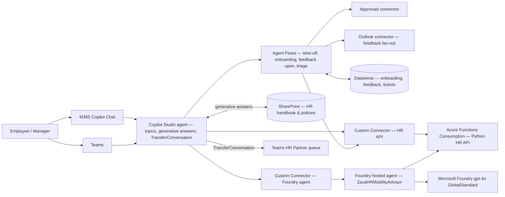

# Architecture — Solution D: Mixed (Copilot Studio primary + Foundry connected agent)

Mermaid source

## Key choices

- **Copilot Studio is the single conversational surface.** Topics are short and mostly call out to flows or connectors — there is no parallel code-first front end.
- **UC1 Policy Q&A uses generative answers over SharePoint** — no Azure AI Search. HR makers update the SharePoint library; the agent picks new content up automatically.
- **UC2/UC3/UC5-open/UC6 stay in Agent Flows.** The Approvals connector covers human approval for time-off; Outlook fan-out covers feedback invitations.
- **UC4 (mobility) and UC5-summary use a Foundry connected agent.** A small `ZavaHRMobilityAdvisor` agent (Microsoft Agent Framework) has only two tools (`match_internal_jobs`, `summarize_feedback_raw`) and is published as a REST endpoint; Copilot Studio invokes it via the Foundry connector.
- **Backend is Azure Functions Consumption.** Same domain as the FastAPI mock from solutions A & C, but Linux Python on Y1 — scales to zero, no container image to roll.
- **No APIM, no Container Apps, no Cosmos, no AI Search.** State lives in Dataverse; auth on the connector is a Functions key.

## Data flow per UC

| UC | Path |
|---|---|
| 1 Policy Q&A | Topic → SharePoint generative answers |
| 2 Time-off | Topic → `HR_RequestLeaveAndApprove` flow → HR API + Approvals connector |
| 3 Onboarding | Topic → `HR_StartOnboarding` flow → HR API + Dataverse; `HR_OnboardingTick` daily flow → Teams reminders |
| 4 Mobility | Topic → Foundry connector → `ZavaHRMobilityAdvisor` (tool: `match_internal_jobs` → HR API) |
| 5 Feedback (open) | Topic → `HR_FeedbackOpen` flow → HR API + Outlook + Dataverse |
| 5 Feedback (summary) | Topic → Foundry connector → `ZavaHRMobilityAdvisor` (tool: `summarize_feedback_raw`) |
| 6 Triage | Topic → HR API `/tickets/classify` → high → `HR_TicketTriage` flow + `TransferConversation` to HR queue; low → generative answers fallback |
