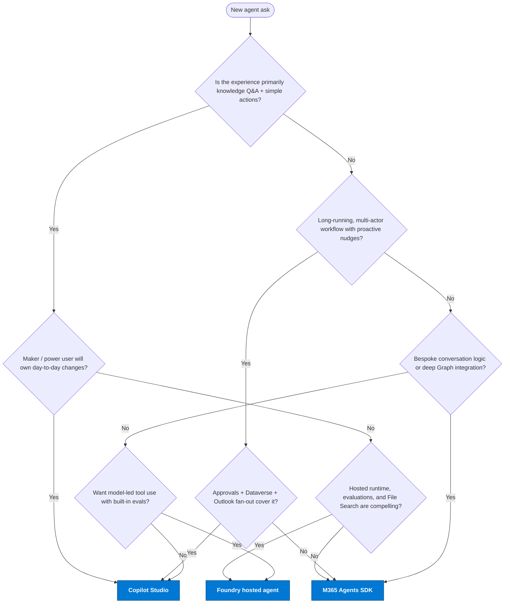

# Choosing between M365 Agents SDK, Copilot Studio, and Foundry

Use this decision tree as a starting point. The repo implements three **pure** paths (A/B/C) so each can be evaluated on its own merits, plus a fourth **recommended mix** (D) in [`mixed-agent/`](../mixed-agent/) for teams who want the lowest-cost / lowest-maintenance / most maker-friendly production starting point.

> **Note on rendering:** GitHub, GitLab, and Foam render Mermaid natively. VS Code's built-in Markdown preview does **not** — install the [Markdown Preview Mermaid Support](https://marketplace.visualstudio.com/items?itemName=bierner.markdown-mermaid) extension to view these diagrams locally.

## Decision tree

Mermaid source

## Mixing them — Solution D in this repo

This repository keeps the three pure implementations completely separate so you can compare them fairly. It also ships a fourth, **opinionated mix** in [`mixed-agent/`](../mixed-agent/) — see [architecture/mixed.md](architecture/mixed.md) and [findings/mixed.md](findings/mixed.md). The shape:

1. **Copilot Studio is the primary surface.** HR makers own topics, generative answers, and Agent Flows.
2. **Foundry hosted agent is invoked as a connected agent** for the two UCs that benefit from model-led reasoning (UC4 mobility, UC5 summary).
3. **Azure Functions Consumption** replaces Container Apps for the HR API → scales to zero.
4. **SharePoint generative answers** replace AI Search; **Dataverse** replaces Cosmos.

Other supported mixes (not implemented here, but common):

- **M365 Agents SDK agent → embeds a Foundry agent client** as a tool when you need both bespoke Graph plumbing and evaluation-graded reasoning.
- **Foundry hosted agent → calls Copilot Studio actions / flows** when you need approvals or Dataverse rows from a code-first agent.

Choose one as the **primary surface** (the thing the user talks to) and let the others be invoked as tools or connected agents — don't duplicate the same workflow in two places.

## Anti-patterns (avoid)

- Re-implementing approvals in code when Copilot Studio's Approvals connector solves UC2 in a flow.
- Building bespoke RAG in code when File Search or Copilot Studio generative answers fit the corpus.
- Splitting a single workflow across all three technologies — pick a primary, invoke the others.
- Hand-editing the published Copilot Studio agent without exporting via `pac solution export` — divergence will bite you.
